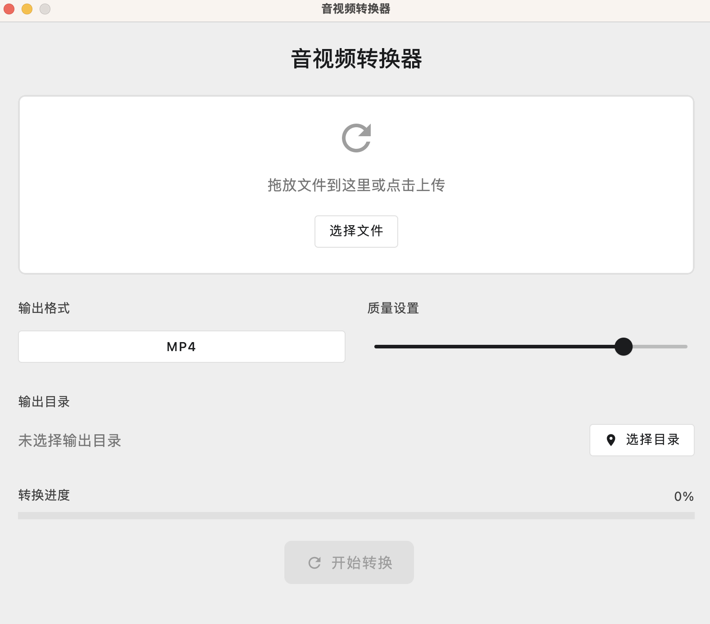

# Media Converter

Media Converter is a lightweight and versatile application for converting audio and video files. Built with Kotlin Compose for Desktop, it features a modern UI and supports a variety of file formats with real-time progress tracking and quality customization.

---

## Features

- **Drag & Drop Support**
  - Drag and drop files into the application to quickly select them for conversion.

- **Format Conversion**
  - Supports a range of media formats for conversion:
    - Video: `mp4`, `avi`, `mkv`, `mov`
    - Audio: `mp3`, `wav`

- **Adjustable Quality**
  - Choose output quality with an easy-to-use slider.

- **Output File Management**
  - Select or customize the output directory.

- **Real-Time Progress Tracking**
  - Monitor the conversion progress with a visual progress bar.

- **Operation Control**
  - Start or cancel conversion processes with intuitive controls.

---

## Screenshot

> A screenshot placeholder for the application’s user interface.


---

## Technology Stack

The project leverages the following technologies:

- **Language**: Kotlin
- **Framework**: Jetpack Compose for Desktop
- **UI Libraries**:
  - `androidx.compose.foundation`
  - `androidx.compose.material`
- **Coroutines**: Powered by Kotlin's `kotlinx.coroutines` for asynchronous processing.
- **Drag & Drop**: Java's `DropTarget` for handling drag-and-drop operations.
- **File Selection**: JFileChooser for system file and directory browsing.

---

## How to Run

1. **Prerequisites**
   - Install [JDK 21](https://www.oracle.com/java/technologies/javase-downloads.html) or higher.
   - Gradle.
   - OpenCV
   - FFMPEG

2. **Clone the Repository**

   ```bash
   git clone https://github.com/nooly1998/MediaConverter.git

The Media Converter project is **dual-licensed** under the following licenses:

---

## MIT License

Copyright (c) [Year] [Your Name or Organization]

Permission is hereby granted, free of charge, to any person obtaining a copy
of this software and associated documentation files (the "Software"), to deal
in the Software without restriction, including without limitation the rights
to use, copy, modify, merge, publish, distribute, sublicense, and/or sell
copies of the Software, and to permit persons to whom the Software is
furnished to do so, subject to the following conditions:

The above copyright notice and this permission notice shall be included in all
copies or substantial portions of the Software.

THE SOFTWARE IS PROVIDED "AS IS", WITHOUT WARRANTY OF ANY KIND, EXPRESS OR
IMPLIED, INCLUDING BUT NOT LIMITED TO THE WARRANTIES OF MERCHANTABILITY,
FITNESS FOR A PARTICULAR PURPOSE AND NONINFRINGEMENT. IN NO EVENT SHALL THE
AUTHORS OR COPYRIGHT HOLDERS BE LIABLE FOR ANY CLAIM, DAMAGES OR OTHER
LIABILITY, WHETHER IN AN ACTION OF CONTRACT, TORT OR OTHERWISE, ARISING FROM,
OUT OF OR IN CONNECTION WITH THE SOFTWARE OR THE USE OR OTHER DEALINGS IN THE
SOFTWARE.

---

## GNU General Public License v3.0 (GPL-3.0)

Copyright (c) [Year] [Your Name or Organization]

This program is free software: you can redistribute it and/or modify it under
the terms of the GNU General Public License as published by the Free Software
Foundation, either version 3 of the License, or (at your option) any later
version.

This program is distributed in the hope that it will be useful, but WITHOUT
ANY WARRANTY; without even the implied warranty of MERCHANTABILITY or FITNESS
FOR A PARTICULAR PURPOSE. See the GNU General Public License for more details.

You should have received a copy of the GNU General Public License along with
this program. If not, see <https://www.gnu.org/licenses/>.

---

# How to Choose the License for Your Use?

- **For permissive usage (including commercial and proprietary applications):** Use the MIT License.
- **For open-source redistributed projects under strong copyleft terms:** Use the GPL-3.0 License.

Please indicate your choice of license when using or distributing the project.
   cd <project-directory>

3. **Run the Application**
   ```kotlin
   gradle run
   ```

4. **Start Converting**  
   Drag and drop media files into the application, customize your output settings, and convert!

---

## Usage

1. **Select Files**
   - Drag files into the application or use